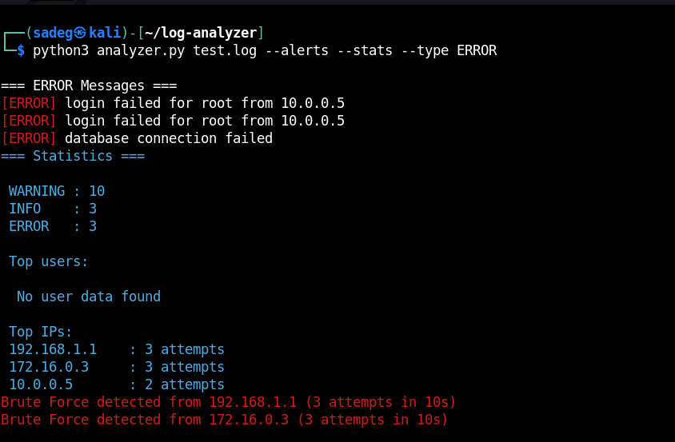

# Security Log Analyzer

A Python tool for analyzing log files and detecting suspicious activities.

## Features
- Parse logs (ERROR, WARNING, INFO)
- Extract IPs and users
- Detect brute force attacks (time-based)
- Export results to JSON

## Example Usage

```bash
python analyzer.py test.log --stats --alerts
```

## Example Output



